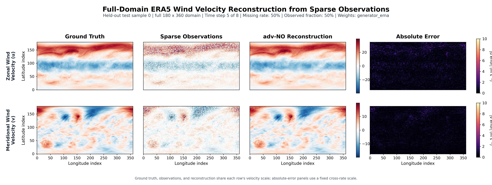

# adv-NO 稀疏流场重建：PRE 与 ERA5

本仓库面向考核任务 A 和任务 D，使用 Gen4Turbulence 中的
`3_flow_reconstruction/no/adv_training` 分支完成稀疏流场重建：

- **任务 A（PRE）**：海洋三维 eastward/northward 流速分量 `u/v`（30 个 sigma 垂向层）；
- **任务 D（ERA5）**：全球 zonal/meridional 风速分量 `u/v`。

当前实现采用保守下采样、有效区域掩码、纯 NO 预训练、GAN 微调和 EMA
推理。完整的实验设计、指标定义、训练记录和答辩材料见
[`docs/PROJECT_REPORT.md`](docs/PROJECT_REPORT.md)。

## 任务状态

| 任务 | 变量 | 状态 | 最终模型 |
| --- | --- | --- | --- |
| A | PRE `u/v` 海洋流速 | 已完成 | NO 预训练 -> RaGAN 微调 -> EMA |
| B | OSTIA SST | 当前未训练 | 不在本仓库正式结果中 |
| C | Copernicus 全球流速场 | 当前未训练 | 不在本仓库正式结果中 |
| D | ERA5 `u/v` 全球风速 | 已完成 | 标准 BCE 模型；另有极端稀疏 RaGAN 实验 |

本项目按考核要求使用 adv-NO 的 GAN 稀疏重建流程。原始仓库中的扩散模型
位于 `3_flow_reconstruction/dm`，不属于当前 A/D 正式结果。

## 数据处理

正式数据处理流程固定为：

1. 相邻时间记录做 2 倍时间平均；
2. 进行 4 倍空间下采样：水平面按 `4 x 4` 网格块做面积加权平均，而不是点抽取或 bicubic 插值；
3. 按时间顺序划分 `train/val/test = 8:1:1`，避免相邻窗口跨集合泄漏；
4. PRE 使用 `mask_rho` 和有限值检查排除陆地；陆地不参与下采样、损失、指标或可视化；
5. ERA5 使用 `cos(latitude)` 面积权重。供给的 ERA5 张量没有海陆掩码，因此正式结果是全球大气网格结果。

处理后的正式形状如下：

| 数据集 | HDF5 字段形状 `[N, C, H, W, D]` | train / val / test |
| --- | --- | --- |
| PRE | `[5295, 2, 100, 110, 30]` | `4236 / 529 / 530` |
| ERA5 | `[219, 2, 180, 360, 8]` | `185 / 17 / 17` |

PRE 的 `D=30` 表示 30 个 terrain-following sigma 垂向层；ERA5 的 `D=8`
表示连续的 8 个经 2 倍时间平均后的时间片，不是物理深度。数据文件由预处理
脚本本地生成，不会提交到 GitHub。

## 模型与训练

### 输入输出

模型使用仓库原有的 3D U-Net 生成器和紧凑 3D PatchGAN 判别器：

```text
PRE:  [B, 4, 64, 64, 16] -> [B, 2, 64, 64, 16]
ERA5: [B, 4, 64, 64,  8] -> [B, 2, 64, 64,  8]
```

以上是训练和单次模型前向传播的 patch 尺寸，不是数据集或最终可视化的
空间范围。正式推理使用重叠 tile 覆盖完整的下采样域，PRE 输出
`100 × 110 × 30`，ERA5 输出 `180 × 360 × 8`。

四个输入通道为均值填充后的稀疏 `u/v` 和共享观测掩码；两个输出通道为
重建后的 `u/v`。`u`、`v` 分别使用训练集统计量做 z-score 归一化。

### 缺失率与损失

- PRE 最终模型和 ERA5 极端模型训练时逐样本随机采样 `0%--100%` 缺失率；ERA5 标准对照模型使用 `10%--90%`；
- 正式测试固定使用 `10%`、`30%`、`50%`、`70%`、`90%`；PRE 还测试
  `1%`，PRE 与 ERA5 极端模型均额外测试 `99%` 缺失率（仅 1% 观测）；
- 生成器使用有效区域约束的归一化 L1；GAN 阶段使用
  `L_G = L_recon + 0.1 L_GAN`；
- 第一阶段只训练纯 NO，第二阶段从第一阶段最佳 `generator_ema` 开始进行
  BCE 或 RaGAN 微调；正式评价默认使用 `generator_ema`。

## 项目结构

| 功能 | 文件 |
| --- | --- |
| 任务说明和命令 | [`README_sparse_tasks.md`](3_flow_reconstruction/no/adv_training/README_sparse_tasks.md) |
| PRE/ERA5 预处理 | [`prepare_sparse_data.py`](3_flow_reconstruction/no/adv_training/prepare_sparse_data.py) |
| 稀疏 adv-NO 训练 | [`train_sparse_adv_no.py`](3_flow_reconstruction/no/adv_training/train_sparse_adv_no.py) |
| 多指标推理评价 | [`evaluate_sparse_metrics.py`](3_flow_reconstruction/no/adv_training/evaluate_sparse_metrics.py) |
| 指标实现 | [`metrics_sparse.py`](3_flow_reconstruction/no/adv_training/metrics_sparse.py) |
| 多种子汇总 | [`aggregate_sparse_metrics.py`](3_flow_reconstruction/no/adv_training/aggregate_sparse_metrics.py) |
| 稀疏重建图 | [`plot_sparse_visualization.py`](3_flow_reconstruction/no/adv_training/plot_sparse_visualization.py) |
| 下采样方法对比图 | [`plot_pre_downsampling.py`](3_flow_reconstruction/no/adv_training/plot_pre_downsampling.py) |
| 完整项目报告 | [`PROJECT_REPORT.md`](docs/PROJECT_REPORT.md) |
| 最终汇报图片 | [`docs/figures/`](docs/figures/) |

## 环境安装

建议使用 Python 3.9 或更高版本，并在具备 CUDA 的环境中运行推理和训练：

```bash
python -m pip install -r requirements.txt
```

CPU 可以运行数据预处理；正式模型训练和推理建议使用 GPU。

## 数据准备

先把源数据路径设置为当前机器上的实际位置，再从仓库根目录运行：

```bash
export PRE_SOURCE=/path/to/PRE_ocean_data
export ERA5_SOURCE=/path/to/era_data/raw_data
mkdir -p data

python -u 3_flow_reconstruction/no/adv_training/prepare_sparse_data.py \
  --task A --source "$PRE_SOURCE" \
  --output data/pre_uv_2t4x_conservative.h5 \
  --cpu-threads 128 --batch-records 16

python -u 3_flow_reconstruction/no/adv_training/prepare_sparse_data.py \
  --task D --source "$ERA5_SOURCE" \
  --output data/era_uv_2t4x_conservative.h5 \
  --cpu-threads 128
```

`--cpu-threads` 可按机器资源调整。预处理输出的 HDF5 文件被 `.gitignore`
排除，需要在本地生成。

## 两阶段训练

所有长任务建议放在独立 `tmux` 会话中。下面给出最终模型的核心命令；完整
参数说明见任务级 README。

### PRE 最终模型（0%--100% 随机缺失率）

```bash
# Stage 1: pure NO pretraining + EMA
CUDA_VISIBLE_DEVICES=0,1 python -u 3_flow_reconstruction/no/adv_training/train_sparse_adv_no.py \
  --data data/pre_uv_2t4x_conservative.h5 \
  --output-dir outputs/pre_no_pretrain_0to100_ema_bs64 \
  --patch 64 --depth 16 --batch-size 64 --epochs 500 \
  --cpu-threads 1 --train-mask-min 0.0 --train-mask-max 1.0 \
  --adversarial-weight 0 --ema-decay 0.999

# Stage 2: RaGAN fine-tuning from Stage-1 generator_ema
CUDA_VISIBLE_DEVICES=0,1 python -u 3_flow_reconstruction/no/adv_training/train_sparse_adv_no.py \
  --data data/pre_uv_2t4x_conservative.h5 \
  --output-dir outputs/pre_ragan_pretrained_0to100_ema_bs64 \
  --patch 64 --depth 16 --batch-size 64 --epochs 500 \
  --cpu-threads 1 --train-mask-min 0.0 --train-mask-max 1.0 \
  --init-generator outputs/pre_no_pretrain_0to100_ema_bs64/best_model.pt \
  --adversarial-loss ragan --adversarial-weight 0.1 --ema-decay 0.999
```

### ERA5 标准模型

标准实验的训练缺失率为 `10%--90%`，分别比较 BCE 和 RaGAN。推荐汇报模型
为预训练 + BCE + EMA；其输出目录为 `outputs/era_bce_pretrained_ema_bs32`。

```bash
# Stage 1: standard-range pure NO pretraining
CUDA_VISIBLE_DEVICES=0,1 python -u 3_flow_reconstruction/no/adv_training/train_sparse_adv_no.py \
  --data data/era_uv_2t4x_conservative.h5 \
  --output-dir outputs/era_no_pretrain_bs32 \
  --patch 64 --depth 8 --batch-size 32 --epochs 500 \
  --train-mask-min 0.1 --train-mask-max 0.9 \
  --adversarial-weight 0 --ema-decay 0.999

# Stage 2: BCE fine-tuning from Stage-1 generator_ema
CUDA_VISIBLE_DEVICES=0,1 python -u 3_flow_reconstruction/no/adv_training/train_sparse_adv_no.py \
  --data data/era_uv_2t4x_conservative.h5 \
  --output-dir outputs/era_bce_pretrained_ema_bs32 \
  --patch 64 --depth 8 --batch-size 32 --epochs 500 \
  --train-mask-min 0.1 --train-mask-max 0.9 \
  --init-generator outputs/era_no_pretrain_bs32/best_model.pt \
  --adversarial-loss bce --adversarial-weight 0.1 --ema-decay 0.999
```

### ERA5 极端稀疏模型

该实验把训练缺失率扩展到 `0%--100%`，专门测试 `90%` 和 `99%` 缺失：

```bash
# Stage 1: pure NO pretraining + EMA
CUDA_VISIBLE_DEVICES=0,1 python -u 3_flow_reconstruction/no/adv_training/train_sparse_adv_no.py \
  --data data/era_uv_2t4x_conservative.h5 \
  --output-dir outputs/era_no_pretrain_0to100_ema_bs32 \
  --patch 64 --depth 8 --batch-size 32 --epochs 500 \
  --train-mask-min 0.0 --train-mask-max 1.0 \
  --adversarial-weight 0 --ema-decay 0.999

# Stage 2: RaGAN fine-tuning
CUDA_VISIBLE_DEVICES=0,1 python -u 3_flow_reconstruction/no/adv_training/train_sparse_adv_no.py \
  --data data/era_uv_2t4x_conservative.h5 \
  --output-dir outputs/era_ragan_pretrained_0to100_ema_bs32 \
  --patch 64 --depth 8 --batch-size 32 --epochs 500 \
  --train-mask-min 0.0 --train-mask-max 1.0 \
  --init-generator outputs/era_no_pretrain_0to100_ema_bs32/best_model.pt \
  --adversarial-loss ragan --adversarial-weight 0.1 --ema-decay 0.999
```

## 推理与可视化

评价只统计 `valid_mask AND missing_mask`，因此 PRE 的陆地和已观测值不会
混入缺失重建指标。以下示例使用 ERA5 极端稀疏模型在 50% 缺失率下评价：

```bash
python -u 3_flow_reconstruction/no/adv_training/evaluate_sparse_metrics.py \
  --data data/era_uv_2t4x_conservative.h5 \
  --checkpoint outputs/era_ragan_pretrained_0to100_ema_bs32/best_model.pt \
  --config outputs/era_ragan_pretrained_0to100_ema_bs32/config.json \
  --output outputs/era_ragan_pretrained_0to100_ema_bs32/metrics_50pct.json \
  --mask-ratio 0.5 --patch 64 --depth 8 --stride 32 \
  --tile-batch 8 --seed 25 --device cuda:0
```

生成单张论文风格图：

```bash
python -u 3_flow_reconstruction/no/adv_training/plot_sparse_visualization.py \
  --data data/era_uv_2t4x_conservative.h5 \
  --checkpoint outputs/era_ragan_pretrained_0to100_ema_bs32/best_model.pt \
  --config outputs/era_ragan_pretrained_0to100_ema_bs32/config.json \
  --output docs/figures/era5_50pct_visualization.png \
  --mask-ratio 0.5 --sample 0 --slice-index 4 --device cuda:0 \
  --patch 64 --depth 8 --stride 32 --tile-batch 8 --error-vmax 10 \
  --title "Full-Domain ERA5 Wind Velocity Reconstruction from Sparse Observations" \
  --u-label "Zonal Wind Velocity (u)" --v-label "Meridional Wind Velocity (v)"
```

评价 PRE 时替换数据、checkpoint 和 config，并在评价脚本中使用
`--depth 16`；PRE 行标签使用 Eastward/Northward Velocity。最终 PRE
的 7 个 JSON 和 PNG 已整理到
[`docs/results/pre_ragan_pretrained_0to100_ema_bs64/`](docs/results/pre_ragan_pretrained_0to100_ema_bs64)
和 [`docs/figures/`](docs/figures)。两个脚本默认读取 `generator_ema`；只有显式使用
`--raw-generator` 才会读取原始生成器。

正式图片展示下采样后的完整域，而不是中心 `64 × 64` patch：PRE 为
`100 × 110`、ERA5 为 `180 × 360`。每张图依次显示 `Ground Truth`、
`Sparse Observations`、`adv-NO Reconstruction` 和 `Absolute Error`。PRE
图片为 `5400 × 2640 px`，使用源 RHO 曲线网格聚合后的真实经纬度
（约 `112.32--115.67°E`、`20.90--23.12°N`），第五维标为 `Sigma layer`；
ERA5 图片为 `5400 × 2040 px`，使用真实全球经纬度 `0--360°E`、
`90°S--90°N`（数组按 `90°N -> 90°S` 降序排列），保持全球场 `2:1` 比例。两类图的列标题均位于图像轴外的
独立留白区域，误差色标分别固定为 `0--0.12 m s^-1` 和 `0--10 m s^-1`。
所有图片均为 `300 dpi`。

## 核心结果

所有结果只在有效缺失位置计算。MAE 和 RMSE 的单位为 `m s^-1`，Relative
L2 和 SSIM 为无量纲指标。PRE 表为最终 RaGAN + EMA 模型、完整 test split、
seed 25；ERA5 标准表为三个随机 seed 的均值 ± 样本标准差。

### PRE 最终模型：0%--100% 随机缺失率训练

| 缺失率 | MAE | RMSE | Relative L2 (%) | SSIM |
| ---: | ---: | ---: | ---: | ---: |
| 1% | 0.001696 | 0.003072 | 1.959 | 0.999720 |
| 10% | 0.001785 | 0.003269 | 2.097 | 0.999661 |
| 30% | 0.002135 | 0.003979 | 2.578 | 0.999442 |
| 50% | 0.002685 | 0.005111 | 3.335 | 0.999055 |
| 70% | 0.003694 | 0.007161 | 4.692 | 0.998099 |
| 90% | 0.006484 | 0.012037 | 7.906 | 0.993863 |
| 99% | 0.014234 | 0.023330 | 15.352 | 0.967172 |

### ERA5 标准范围：预训练 + BCE + EMA

| 缺失率 | MAE | RMSE | Relative L2 (%) | SSIM |
| ---: | ---: | ---: | ---: | ---: |
| 10% | 0.3299 ± 0.0001 | 0.4485 ± 0.0002 | 5.839 | 0.9815 |
| 30% | 0.3802 ± 0.0003 | 0.5180 ± 0.0003 | 6.792 | 0.9755 |
| 50% | 0.4205 ± 0.0001 | 0.5697 ± 0.0002 | 7.437 | 0.9681 |
| 70% | 0.5043 ± 0.0005 | 0.6838 ± 0.0008 | 8.868 | 0.9531 |
| 90% | 0.8352 ± 0.0013 | 1.1571 ± 0.0015 | 14.875 | 0.8800 |

### ERA5 极端稀疏：预训练 + RaGAN + EMA，训练缺失率 0%--100%

| 缺失率 | 观测率 | MAE | RMSE | Relative L2 (%) | SSIM |
| ---: | ---: | ---: | ---: | ---: | ---: |
| 10% | 90% | 0.4182 | 0.5713 | 7.545 | 0.9755 |
| 30% | 70% | 0.4575 | 0.6326 | 8.342 | 0.9658 |
| 50% | 50% | 0.4929 | 0.6739 | 8.842 | 0.9564 |
| 70% | 30% | 0.5649 | 0.7656 | 10.019 | 0.9409 |
| 90% | 10% | 0.8003 | 1.0820 | 14.168 | 0.8847 |
| 99% | 1% | 1.6529 | 2.2499 | 29.358 | 0.6522 |

标准范围内优先使用 ERA5 预训练 + BCE + EMA；极端稀疏时使用 0%--100%
训练的 RaGAN + EMA。ERA5 的 99% 缺失结果仍保留了较高的大尺度相关性，
但点值误差已经明显，不应表述为高精度重建。

PRE 的最终 99% 缺失率测试结果为 Relative L2 `15.35%`、SSIM `0.9672`，
模型 MAE 低于最近邻和高斯插值基线，说明将极端缺失率纳入训练后鲁棒性明显改善。

代表性结果图：



其他缺失率的 PRE/ERA5 图像见 [`docs/figures/`](docs/figures/)，完整三线表和
指标公式见 [`docs/PROJECT_REPORT.md`](docs/PROJECT_REPORT.md)。

## 数据与权重

任务 A/D 的原始数据、处理后的 HDF5、训练日志和新 checkpoint 不提交到
GitHub，统一由 `.gitignore` 排除。复现实验时需要在本地准备源数据并按上文
命令生成 `data/` 和 `outputs/`。仓库中保留的少量上游示例权重属于原始项目，
不代表当前 PRE/ERA5 正式 checkpoint。

## 上游项目与引用

本项目基于 [Gen4Turbulence](https://github.com/vivekoommen/Gen4Turbulence)：

> Oommen et al., *Learning Turbulent Flows with Generative Models for
> Super-resolution, Forecasting, and Sparse Flow Reconstruction*, Nature
> Communications / arXiv:2509.08752, 2025.

```bibtex
@article{oommen2025learning,
  author={Oommen, Vivek and Khodakarami, Siavash and Bora, Aniruddha and Wang, Zhicheng and Karniadakis, George Em},
  title={Learning Turbulent Flows with Generative Models: Super-resolution, Forecasting, and Sparse Flow Reconstruction},
  journal={arXiv preprint arXiv:2509.08752},
  year={2025}
}
```

上游项目及本仓库遵循 MIT License，详见 [`LICENSE`](LICENSE)。原始项目使用的
MedicalNet、Real-ESRGAN 和 diffusion 相关依赖仍按上游项目说明保留。
